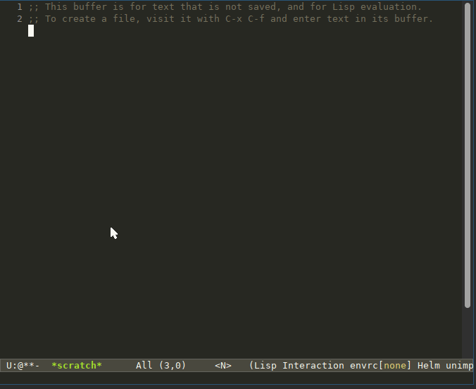
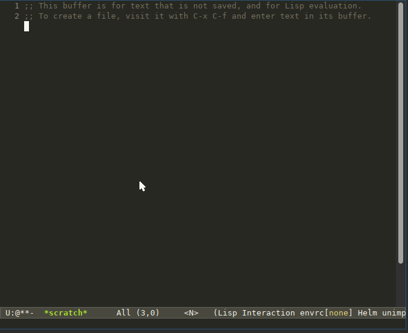
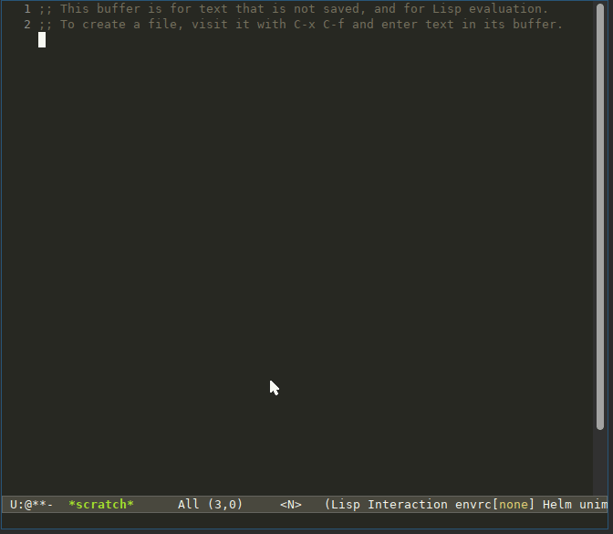

# My Repo Pins  [](https://github.com/NinjaTrappeur/my-repo-pins/actions/workflows/test.yml) [](https://melpa.org/#/my-repo-pins)


My Repo Pins - move between projects quickly

Open source developers often have to jump between projects, either to read code, or to craft patches. My Repo Pins reduces the friction so that it becomes trivial to do so.

The idea of the plugin is based on this idea; if the repository URLs can be translated to a filesystem location, the local disk can be used like a cache. My Repo Pins lazily clones the repo to the filesystem location if needed, and then jumps into the project in one single command. You don't have to remember where you put the project on the local filesystem because it's always using the same location. Something like this:

```
~/code-root
├── codeberg.org
│   └── Freeyourgadget
│       └── Gadgetbridge
└── github.com
    ├── BaseAdresseNationale
    │   └── fantoir
    ├── mpv-player
    │   └── mpv
    └── NinjaTrappeur
        ├── cinny
        └── my-repo-pins
```

This Emacs plugin aims to help you navigate this repository tree **and** clone new repositories at the right place in the tree.

## Show me What You've Got

As always, a small demo is worth a thousand words!

**Jump to a local repository you already cloned:**



**Find a repository in a remote forge, clone it, and jump to it:**



**Alternatively, you can also specify a absolute git URL you want to clone:**



## Installation

### Via MELPA (recommended)

This package is available on [MELPA](https://melpa.org). After [adding MELPA to your `packages-archives`](https://melpa.org/#/getting-started), run:

```
M-x package-install
my-repo-pins
```

### Manually

Clone this repository, open the `my-repo-pins.el` file, then, install the package using `M-x package-install-file`.

## Quick Start

The minimal configuration consists in setting the directory in which you want to clone all your git repositories via the `my-repo-pins-code-root` variable.

Let's say you'd like to store all your git repositories in the `~/code-root` directory. You'll want to add the following snippet in your Emacs configuration file:

```elisp
(require 'h)
(setq my-repo-pins-code-root "~/code-root")
```

You can then call the `M-x my-repo-pins` command to open a project living in your `~/code-root` directory **or** clone a new project in your code root.

Binding this command to a global key binding might make things a bit more convenient. I personally like to bind it to `M-h`. You can add the following snippet to your Emacs configuration to set up this key binding:

```elisp
(global-set-key (kbd "M-h") 'my-repo-pins)
```

## Customization

### my-repo-pins-code-root - REQUIRED

Path to the directory containing all your projects. `my-repo-pins` organize the git repos you'll clone in a tree fashion.

All the code fetched using `my-repo-pins` will end up in this root directory. A tree of subdirectories will be created mirroring the remote clone URL.

For instance, after checking out https://git.savannah.gnu.org/git/emacs/org-mode.git, the source code will live in the my-repo-pins-code-root/git.savannah.gnu.org/git/emacs/org-mode/ local directory

### my-repo-pins-git-bin

Path pointing to the git binary. By default, it'll look for git in the current `$PATH`.

### my-repo-pins-forge-fetchers

Alist in the form of `("FORGE NAME" . FETCH-FUNCTION)` where `FETCH-FUNCTION` is a function in charge of retrieving a potential remote clone URL. More about this function in the [Fetchers](#fetchers) section.

## Fetchers

When a repository cannot be found in the code root directory, `my-repo-pins` will try to download it from different forges. By default, it'll try to find it on github.com, gitlab.com, git.sr.ht, and codeberg.org.

### Re-Using the Default Fetchers for your own Forge Instance

My-repo-pins provides some generic fetchers for Gitlab, Sourcehut, and Gitea.

You can re-use these generic fetchers for your own forge instance using the following functions:

- GitLab: `my-repo-pins--query-gitlab-owner-repo`
- SourceHut: `my-repo-pins--query-sourcehut-owner-repo`
- Gitea: `my-repo-pins--query-gitea-owner-repo`

These functions share the same 4 input arguments:

- `instance-url`: your instance [FQDN](https://fr.wikipedia.org/wiki/Fully_qualified_domain_name). For instance: `gitlab.gnome.org`, `git.alternativebit.fr`, …
- `user-name`: the user name for which we want to clone the repository.
- `repo-name`: name of the repository we want to clone.
- `callback`: function `my-repo-pins` will use to clone the repository once we retrieved the various clone URLs. The callback takes an alist as parameter. The alist being of the form of : `((ssh . SSH-CHECKOUT-URL) (https . HTTPS-CHECKOUT-URL))`.

You can re-use these functions by instantiating them for a specific forge, then by appending this instantiation to the `my-repo-pins-forge-fetchers` variable in your Emacs configuration.

Let's say you want to retrieve repositories from the Gnome Gitlab instance living at `gitlab.gnome.org`. You'll have to add the following snippet to your Emacs configuration:

```elisp
(setq my-repo-pins-forge-fetchers
      `(("gitlab.gnome.org" (lambda (owner repo cb)(my-repo-pins--query-gitlab-owner-repo "gitlab.gnome.org" owner repo cb)))
        ,my-repo-pins-forge-fetchers))
```

### Writing your Forge Fetcher from Scratch

You may also want to support a forge for which `my-repo-pins` currently does not provide any generic fetcher. In that case, you'll have to write a function in the form of:

```elisp
(defun your-custom-fetcher (owner repo)
; (..) the actual implementation
)
```

The function needs to accept two input parameters:

- `owner`: string containing the name of the owner of the query repository. IE. `ninjatrappeur` for the `ninjatrappeur/my-repo-pins` query.
- `repository`: string containing the name of the query repository. IE. `my-repo-pins` for the `ninjatrappeur/my-repo-pins` query.

This function will return either `nil` in case the query couldn't be found on the remote forge. An alist containing the SSH and HTTPS clone URLs in the form of:

```elisp
'((ssh . SSH-CHECKOUT-URL)
  (https . HTTPS-CHECKOUT-URL))
```

## Aknowledgements

- This plugin is heavily inspired by [**Zimbatm's h**](https://github.com/zimbatm/h). Thanks a lot for this amazing tool, it made my life easier for years!
- Thanks a lot to Wiwi who found the **terrible** pun we used to name this project.
